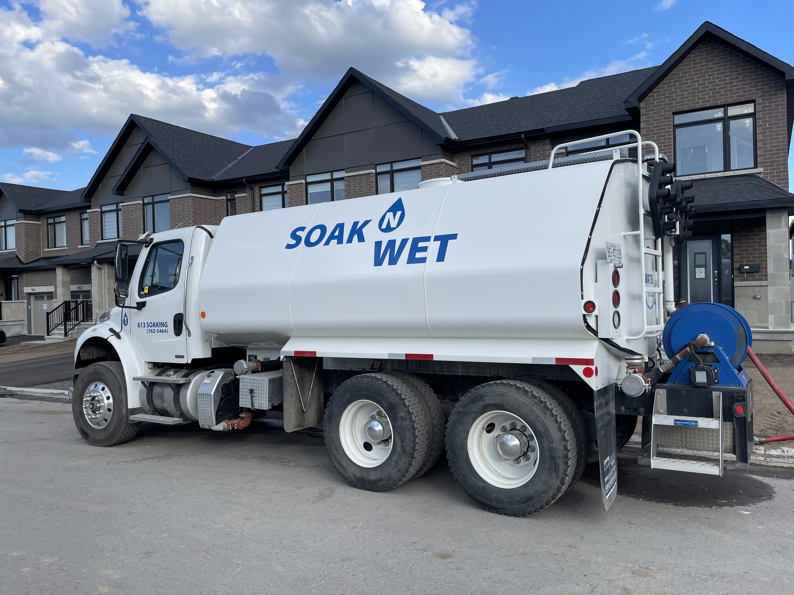
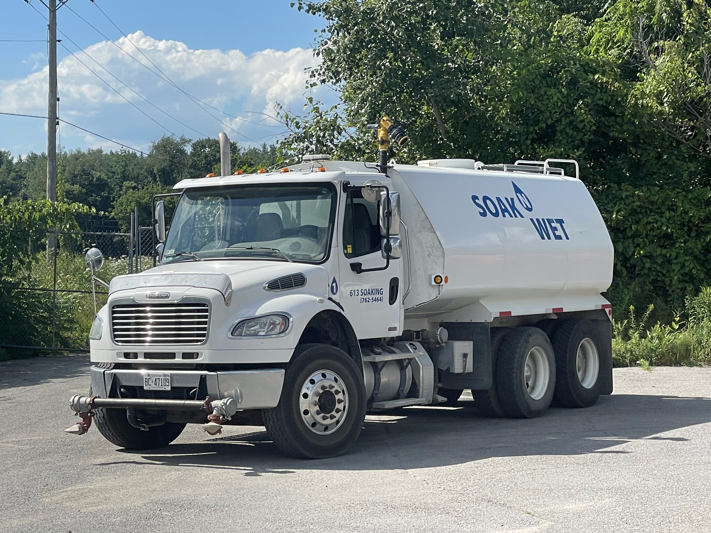
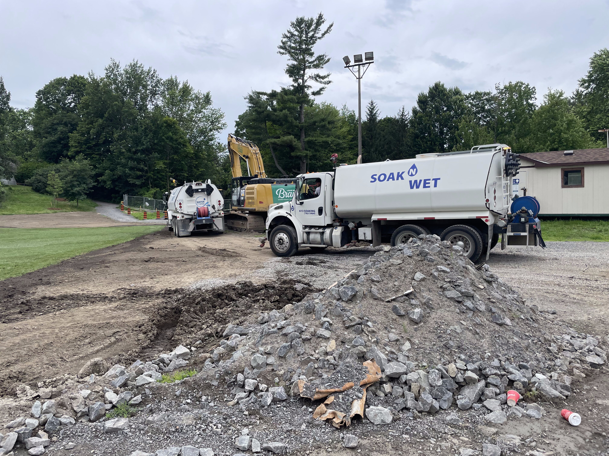
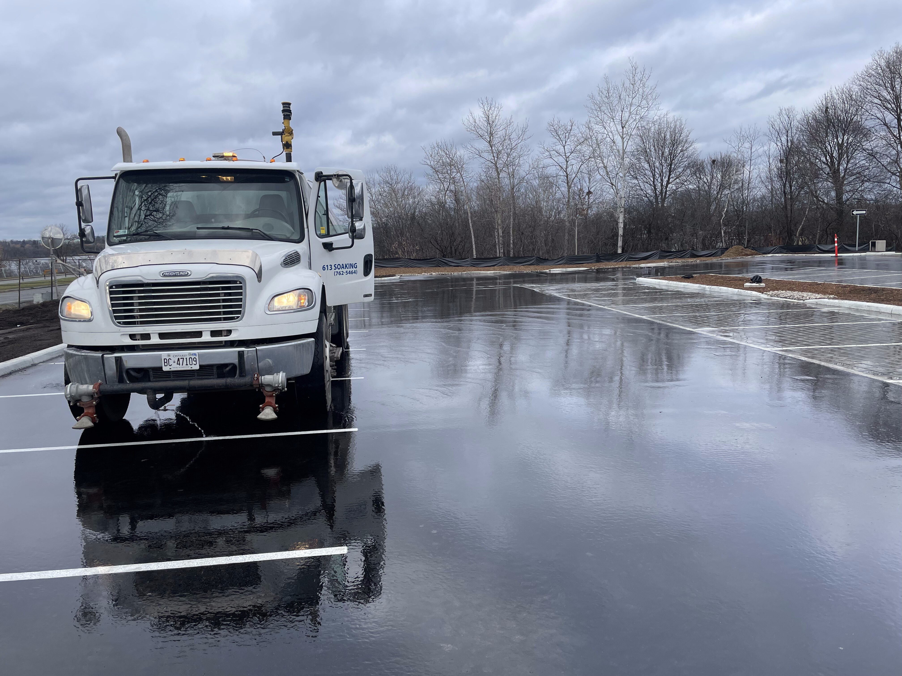
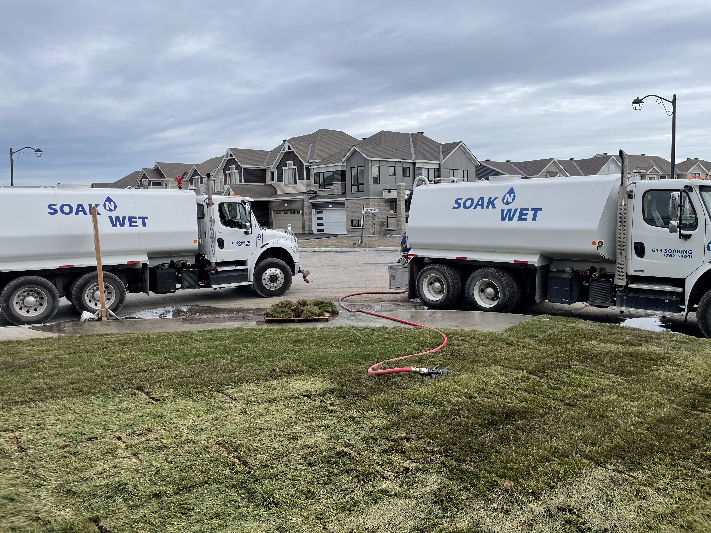

# Cursor Instructions — Soak N Wet Website Update

All images and videos are in the `images/` folder. Here's what each file is and where it goes.

---

## Image Reference Guide

| File | What it shows | Use on site |
|---|---|---|
| `images/truck-airport-dust-control.jpg` | Soak N Wet truck on a wide airport tarmac/runway, clear blue sky | **Dust Suppression** service block (`#dust`) on `services.html` |
| `images/truck-construction-site.jpg` | Soak N Wet truck on an active construction site next to an excavator, rubble and gravel visible | **Construction Site Supply** service block (`#construction`) on `services.html` |
| `images/two-trucks-landscaper-watering.jpg` | Two Soak N Wet trucks side-by-side watering freshly laid sod in a new residential development | **Landscaper Water Services** service block (new — see below) on `services.html` |
| `images/sod-landscaper-delivery.jpg` | Pallets of rolled sod stacked next to a Soak N Wet truck | Secondary image for **Landscaper Water Services** block — use as a detail/supporting visual |
| `images/truck-rural-road.jpg` | Truck parked on a rural road, front view, trees behind | **Residential Well Water** service block (`#well`) on `services.html` |
| `images/truck-residential-suburb.jpg` | Clean rear/side shot of the truck in a suburban neighbourhood, brand logo clearly visible | **Homepage hero** section background or the **About** page |

### Videos (labeled for future use — do NOT add to hero yet)
| File | Label |
|---|---|
| `images/video-truck-action-01.mov` | Action footage — truck in operation |
| `images/video-truck-action-02.mov` | Action footage — truck in operation |

---

## What to change on `services.html`

### 1. Replace all `.svc-vis` placeholder boxes with real images

Each service block has a `<div class="svc-vis">` containing a `<div class="svc-vis-icon">TEXT</div>` placeholder. Replace each one with a proper `` tag:

**#pool block** — no photo yet, keep placeholder or use `truck-residential-suburb.jpg` as a fallback:
```html
<div class="svc-vis" data-animate="fade-right" data-svc-delay="1">
  
</div>
```

**#well block** — use `truck-rural-road.jpg`:
```html
<div class="svc-vis" data-animate="fade-right" data-svc-delay="1">
  
</div>
```

**#cistern block** — no dedicated photo, reuse `truck-rural-road.jpg`:
```html
<div class="svc-vis" data-animate="fade-right" data-svc-delay="1">
  
</div>
```

**#construction block** — use `truck-construction-site.jpg`:
```html
<div class="svc-vis" data-animate="fade-right" data-svc-delay="1">
  
</div>
```

**#dust block** — use `truck-airport-dust-control.jpg`:
```html
<div class="svc-vis" data-animate="fade-right" data-svc-delay="1">
  
</div>
```

**#emergency block** — no dedicated photo, reuse `truck-residential-suburb.jpg`:
```html
<div class="svc-vis" data-animate="fade-right" data-svc-delay="1">
  
</div>
```

---

### 2. Add CSS for the image inside `.svc-vis`

The `.svc-vis` div was designed for a text placeholder. Add these styles so the photo fills it properly (add to `site.css`):

```css
.svc-vis img {
  width: 100%;
  height: 100%;
  object-fit: cover;
  border-radius: inherit;
  display: block;
}
```

---

### 3. Add THREE new service blocks to `services.html`

Insert these after the `#construction` block and before `#dust`. They use the client's actual services that are missing from the current site.

#### New Block: Landscaper Water Services (id="landscapers")

```html
<div class="svc-block" id="landscapers">
  <div data-animate="fade-left">
    <span class="svc-num">04b</span>
    <h2>Water Services for<br><span>Landscapers</span></h2>
    <p>Sod doesn't survive without water — and we move fast enough to keep up with your crew. Whether you're laying thousands of square feet or watering in new tree installations, we deliver the volume you need on-site, on time.</p>
    <p>We work regularly with landscaping companies across Ottawa. One call and we'll coordinate with your schedule.</p>
    <ul class="svc-details">
      <li>Sod watering immediately after installation</li>
      <li>Tree and shrub watering for new plantings</li>
      <li>High-volume delivery for large commercial installs</li>
      <li>Multiple trucks available for big jobs</li>
    </ul>
    <a href="contact.html" class="btn-p">Book Landscaper Water &rarr;</a>
  </div>
  <div class="svc-vis" data-animate="fade-right" data-svc-delay="1">
    
  </div>
</div>
```

#### New Block: Hockey Rink Flooding (id="hockey")

```html
<div class="svc-block" id="hockey">
  <div data-animate="fade-left">
    <span class="svc-num">07</span>
    <h2>Hockey Rink<br><span>Flooding</span></h2>
    <p>Building an outdoor rink this winter? We flood it fast so you're skating sooner. Whether it's a backyard rink or a community pad, we deliver the volume needed to get a solid base layer down in one visit.</p>
    <p>Available across Ottawa and surrounding areas throughout the winter season. Book early — spots fill up fast once the cold hits.</p>
    <ul class="svc-details">
      <li>Backyard and community rink flooding</li>
      <li>Initial flood and top-up visits available</li>
      <li>Fast delivery to get ice conditions right</li>
      <li>Serving Ottawa and surrounding areas all winter</li>
    </ul>
    <a href="contact.html" class="btn-p">Book Rink Flooding &rarr;</a>
  </div>
  <div class="svc-vis" data-animate="fade-right" data-svc-delay="1">
    <!-- No photo yet — keep placeholder until client provides a hockey rink image -->
    <div class="svc-vis-icon">RINK</div>
  </div>
</div>
```

#### New Block: Road Flushing (id="road-flushing")

Add this as a bullet point expansion under the **#dust** block OR as its own block. Recommended approach — add it as a separate block:

```html
<div class="svc-block" id="road-flushing">
  <div data-animate="fade-left">
    <span class="svc-num">08</span>
    <h2>Road<br><span>Flushing</span></h2>
    <p>Debris, mud, and construction runoff build up fast on site access roads and public streets near active projects. We flush roads clean — keeping sites compliant, reducing tracking, and protecting storm drains.</p>
    <p>Used by general contractors, municipalities, and industrial sites across the Ottawa region.</p>
    <ul class="svc-details">
      <li>Construction site access road cleanup</li>
      <li>Post-pour and post-grade flushing</li>
      <li>Municipal and commercial applications</li>
      <li>Available on short notice</li>
    </ul>
    <a href="contact.html" class="btn-p">Request Road Flushing &rarr;</a>
  </div>
  <div class="svc-vis" data-animate="fade-right" data-svc-delay="1">
    
  </div>
</div>
```

---

### 4. Update the homepage `index.html`

In the services list section (`svs-list`), the heading currently says **"Six Ways We Move Water"** — update it to **"Nine Ways We Move Water"** (or just **"Every Way We Move Water"**).

Also add three new service rows to the `svs-list` for the new services:

```html
<a href="services.html#landscapers" class="sr" data-animate="fade-up" data-stagger="5">
  <div class="sr-left">
    <span class="sr-bg" aria-hidden="true">07</span>
    <span class="sr-bar" aria-hidden="true"></span>
    <span class="sr-num">07</span>
  </div>
  <div class="sr-mid"><div class="sr-name">Landscaper Water Services</div><div class="sr-desc">Sod installs, tree watering, and large-scale landscaping jobs. We keep up with your crew.</div></div>
  <span class="sr-arrow">&rarr;</span>
</a>
<a href="services.html#hockey" class="sr" data-animate="fade-up" data-stagger="6">
  <div class="sr-left">
    <span class="sr-bg" aria-hidden="true">08</span>
    <span class="sr-bar" aria-hidden="true"></span>
    <span class="sr-num">08</span>
  </div>
  <div class="sr-mid"><div class="sr-name">Hockey Rink Flooding</div><div class="sr-desc">Backyard and community rinks flooded fast. Book early — winter slots go quick.</div></div>
  <span class="sr-arrow">&rarr;</span>
</a>
<a href="services.html#road-flushing" class="sr" data-animate="fade-up" data-stagger="7">
  <div class="sr-left">
    <span class="sr-bg" aria-hidden="true">09</span>
    <span class="sr-bar" aria-hidden="true"></span>
    <span class="sr-num">09</span>
  </div>
  <div class="sr-mid"><div class="sr-name">Road Flushing</div><div class="sr-desc">Post-construction road cleanup, mud and debris removal. Fast, on short notice.</div></div>
  <span class="sr-arrow">&rarr;</span>
</a>
```

---

### 5. Update the footer service list on both pages

In `index.html` and `services.html`, the footer `<ul>` under "Services" is missing the three new services. Add:

```html
<li><a href="services.html#landscapers">Landscaper Water Services</a></li>
<li><a href="services.html#hockey">Hockey Rink Flooding</a></li>
<li><a href="services.html#road-flushing">Road Flushing</a></li>
```

---

### 6. Update the marquee ticker on both pages

Add the three new services to both marquee rows in `index.html` and `services.html`:

In the first row (mixed case), add:
```html
<span class="mq-item">Landscaper Services<span class="mq-dot"></span></span>
<span class="mq-item">Hockey Rinks<span class="mq-dot"></span></span>
<span class="mq-item">Road Flushing<span class="mq-dot"></span></span>
```

In the second row (all caps), add:
```html
<span class="mq-item">LANDSCAPER SERVICES<span class="mq-dot"></span></span>
<span class="mq-item">HOCKEY RINKS<span class="mq-dot"></span></span>
<span class="mq-item">ROAD FLUSHING<span class="mq-dot"></span></span>
```

(Add duplicates of each since the marquee loops — add them to both the first and second halves of each row.)

---

## Summary of files added

```
soak-n-wet/
└── images/
    ├── truck-airport-dust-control.jpg       ← Dust suppression + road flushing
    ├── truck-construction-site.jpg          ← Construction site supply
    ├── two-trucks-landscaper-watering.jpg   ← Landscaper water services (hero image)
    ├── sod-landscaper-delivery.jpg          ← Landscaper services (supporting)
    ├── truck-rural-road.jpg                 ← Well water + cistern delivery
    ├── truck-residential-suburb.jpg         ← Pool fills + about page + hero fallback
    ├── video-truck-action-01.mov            ← (FUTURE) In-action video — do not add yet
    └── video-truck-action-02.mov            ← (FUTURE) In-action video — do not add yet
```
